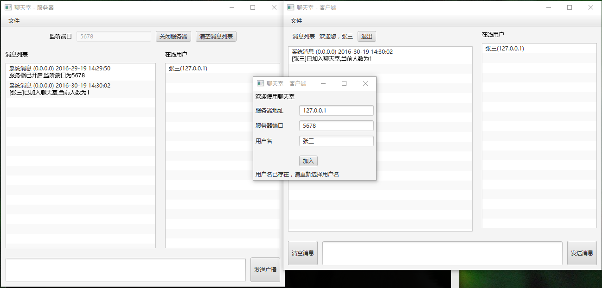
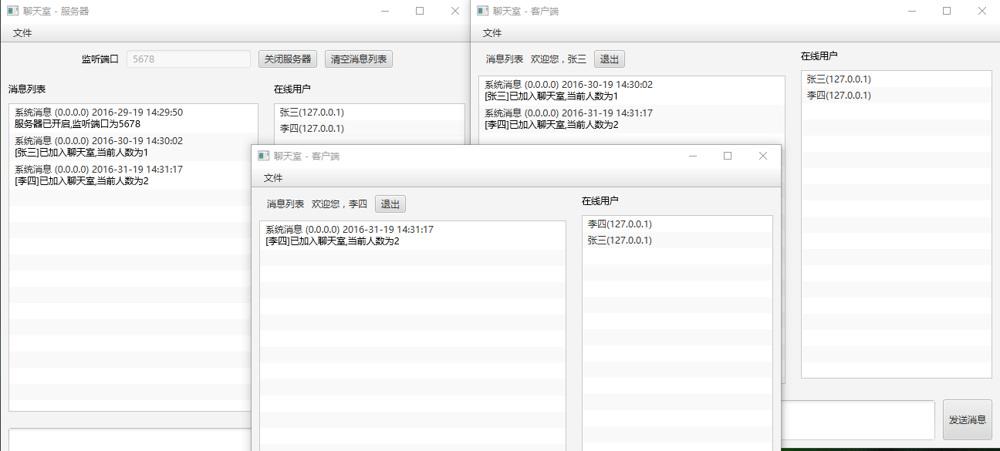
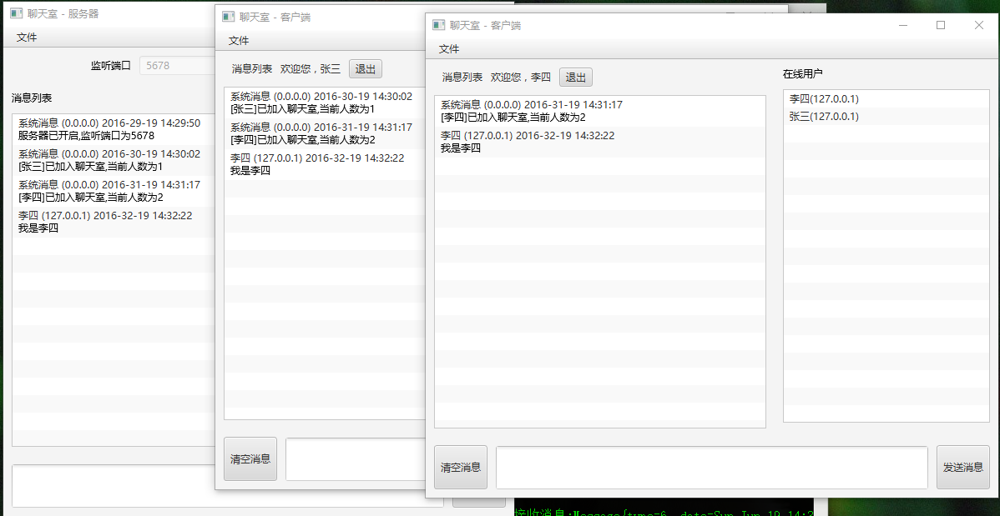
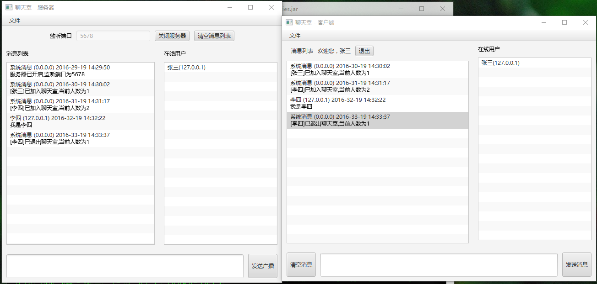

# ChatRoom 聊天室 (JavaFX)
Java/Socket/JavaFx/Maven

## 项目结构
使用 Maven 管理依赖。
<pre>
ChatRoom\  
 |--pom.xml             Maven父模块依赖定义  
 |--ChatRoom-Share\     服务器与客户端共享的模型类  
 |--ChatRoom-Server\    服务器端  
 |--ChatRoom-Client\    客户端  
</pre>
使用强大的`maven-assembly-plugin`插件打包。  
需要先在 ChatRoom 模块install, 然后再在 Client/Server 里使用 `assembly:assembly`.  

## 截图
登录：  
  

登录成功：  
  

发送消息：  
  

退出：  
  